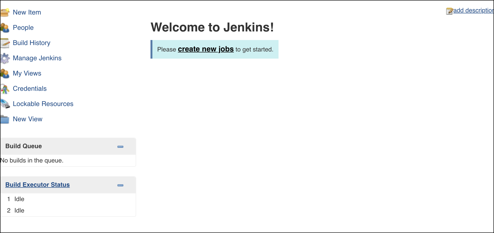
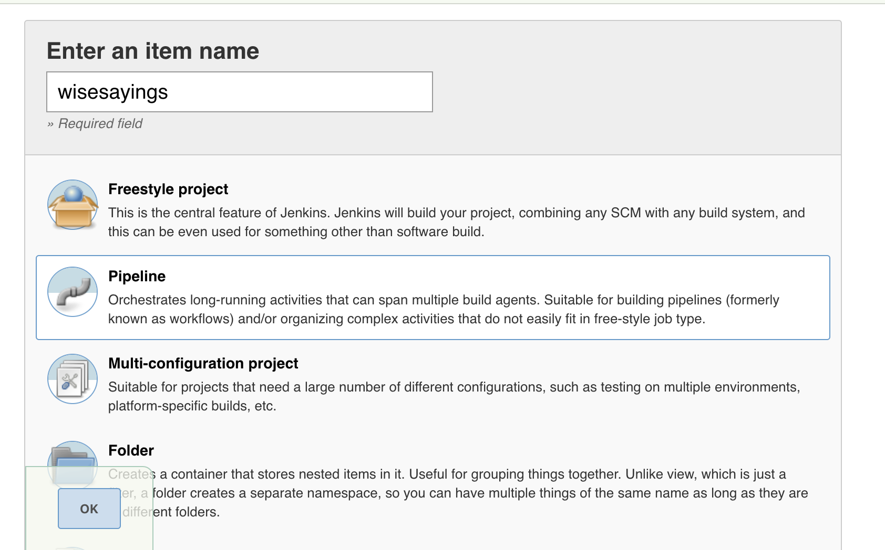
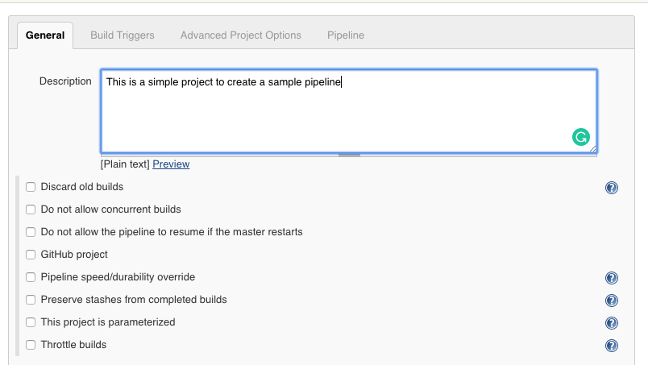
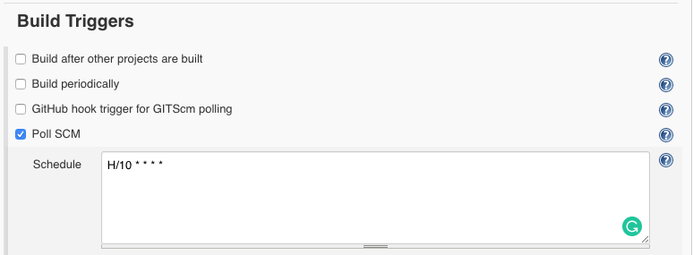
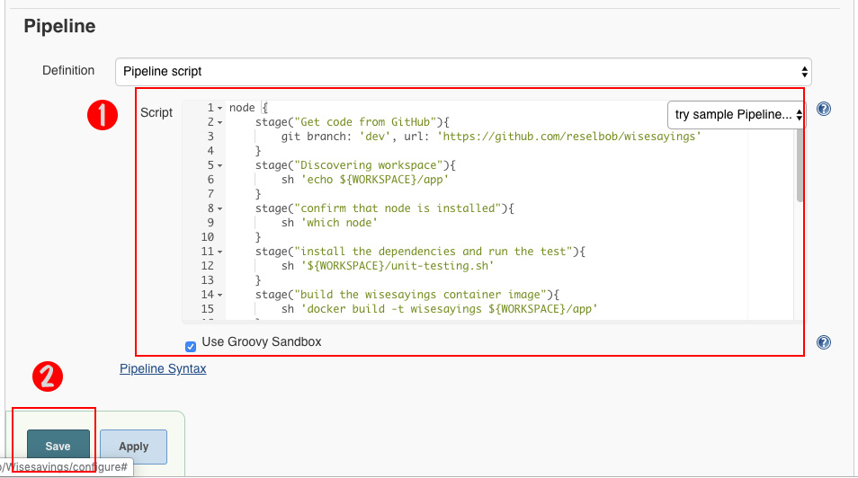
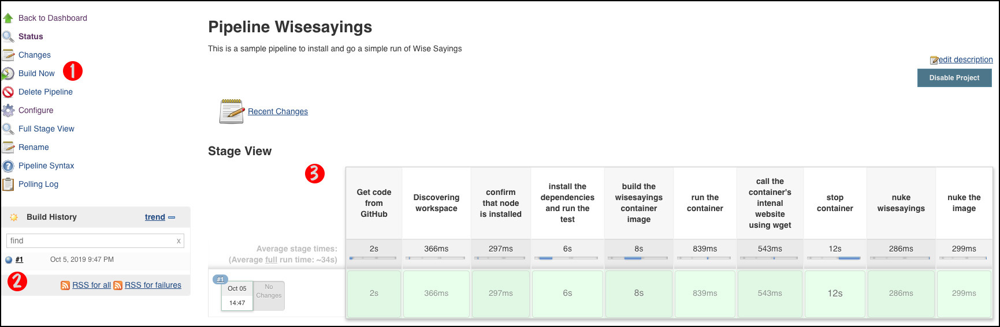

# Creating a CI/CD Pipeline using Fat Jenkins

The purpose of this exercise is to demonstrate how to implement a CI/CD
pipeline under Fat Jenkins that gets, tests and deploys code.

This document assumes that you have followed the steps for getting FatJenkins up and running as
described in this page [here](README.md).
 
In this exercise we're going create Jenkins Pipeline job that:

* gets the code for the microservice, `wisesayings` from the repository, [https://github.com/reselbob/wisesaying](https://github.com/reselbob/wisesaying)
* builds a Docker container image from source code
* runs a Docker container from the Docker image that Jenkins built
* exercises the Wise Saying web server running in the container.

**Step 1:** Create a job by clicking on the `create new job` link as shown in the figure below.



**Step 2:** Enter the job name, in this case `wisesayings`. Then select `Pipeline` from the types of jobs lists. 
Finally, click the OK, button on the lower left of the web page, as shown in the figure below.



**Step 3:** You'll be taken to the job configuration page. Enter a short `Description` about the job as 
shown in the figure below.



**Step 4:** Select the `Poll SCM` option in the `Build Triggers` section. Then enter a polling
 interval, for example `H/10 * * * *` as shown in the figure below.



The interval statement,`H/10 * * * *` indicates that the GitHub repo will be polled every 10 minutes.

**Step 5:** Create the Pipeline script.

Enter the following script in the section, `Pipeline` as shown at the callout (1) in the figure that follows the code.

```
node {
    stage("Get code from GitHub"){
        git branch: 'dev', url: 'https://github.com/reselbob/wisesayings'
    }
    stage("Discovering workspace"){
        sh 'echo ${WORKSPACE}/app'
    }
    stage("confirm that node is installed"){
        sh 'which node'
    }
    stage("install the dependencies and run the test"){
        sh '${WORKSPACE}/unit-testing.sh'
    }
    stage("build the wisesayings container image"){
        sh 'docker build -t wisesayings ${WORKSPACE}/app'
    }
    stage("run the container"){
        sh 'docker run -d --name mywisesayings -p 3001:3000 wisesayings'
    }
    stage("call the container's intenal website using wget"){
        sh 'docker exec -i mywisesayings wget -qO- localhost:3000'
    }
    stage("stop container"){
        sh 'docker stop mywisesayings'
    }
    stage("nuke wisesayings"){
        sh 'docker rm mywisesayings'
    }
    stage("nuke the image"){
        sh 'docker rmi -f wisesayings'
    }
}
```



Then save the job by clicking the `Save` button as shown at callout (2) in the figure above.

**Step 6:**  Start the Pipeline job.

You start the Pipeline job by clicking the link, `Build now` as shown at callout (1) on the left side of the figure below.
 
You can view the progress as shown at callout (2) and then watch the outcome as shown at callout (3)
 in the figure below.



## Review

In this lesson you've created a Jenkins Pipeline job that:

* gets the code for the microservice, `Wise Sayings` from the repository, [https://github.com/reselbob/wisesaying](https://github.com/reselbob/wisesaying)
* builds a Docker container image from source code
* runs a Docker container from the Docker image that Jenkins built
* exercises the Wise Saying web server running in the container.

**EXERCISE COMPLETE**